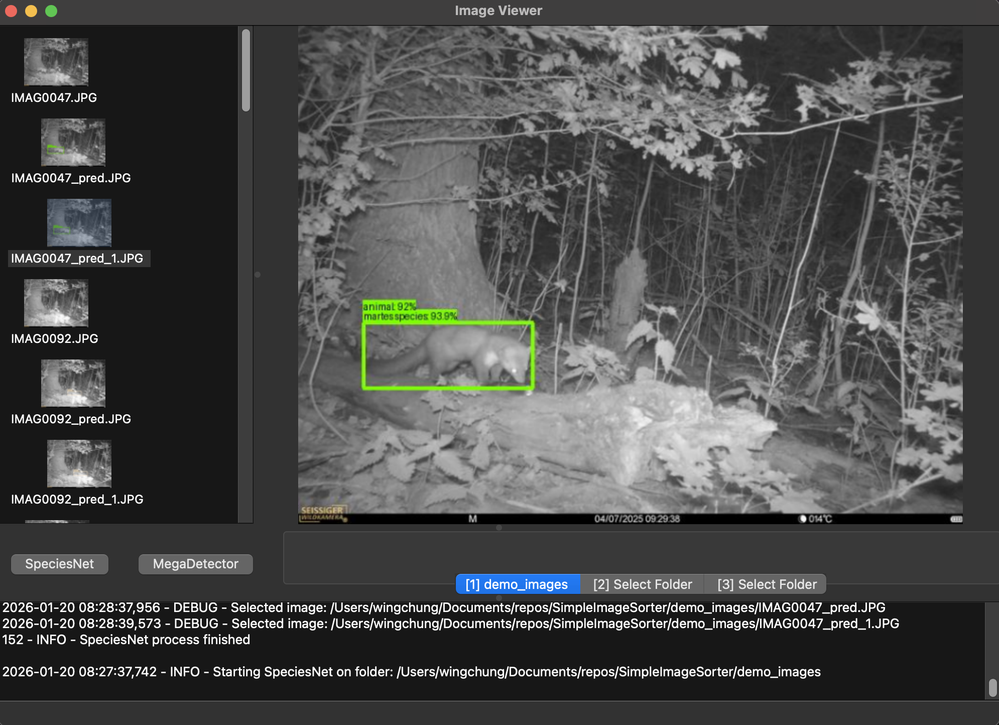

# SpeciesNetImageSorter
SpeciesNet and Megadetector application to easily identify species on wildlife photos and sort them in folders using key presses.

This application is used to easily view through all images in a folder and to sort them one by one using key presses to new folders.

Application is build in python and compiled to .exe

To run the application in non-compiled form, you can use `uv run main.py`

```
./SimpleImageSorter/
    ├── main.py
    app/
        ├── image_viewer.py
        ├── image_loader.py
        ├── thumbnail_creator.py
        └── file_operations.py
```



# How to use Sorting
1. Open the compiled application.
2. Select the main image folder containing all the images from the `menu bar` on top
3. Define up to 3 new folders linked to numerical key presses `1`, `2`, `3`.
4. Use arrow keys to go through images. `Down` and `Right` to go to next image. `Up` and `Left` to go back to previous image
5. Press the designated numerical key to copy image to the respective folder.

# How to use SpeciesNet Detection
1. Open the compiled application.
2. Select the main image folder containing all the images from the `menu bar` on top
   Alternatively, you can also directly press on "Run SpeciesNet" to run it on a chosen directory containing the images.
3. After running SpeciesNet, a new `prediction.json` file will be generated containing the species probabilities and bounding boxes

# How to use MegaDetector Bounding boxes
1. After running SpeciesNet, a new `prediction.json` file is generated in the folder.
2. The folder containing the `prediction.json` file should be the current opened folder with the wildlife images. If not, open the correct folder with the wildlife images with the generated `predictions.json`
3. Press 'Run Megadetector' and new images will be generated with the bounding boxes
4. You can now reopen the folder to also load in the new generated bounding box images.


# Local run
If you do not always have access to internet and/or worry about needing a network to access the AI models. 
You can download the models to your local directory running the script in `./weights/download_weights.py`
The downloaded models can then be used for the detection and interference tasks.

## Requirements
- Windows Computer that can run .exe
- >8 GB RAM (Depends on number of images and if you are going to run it locally)
- CPU that can handle AI inference workloads
  if you have a NVIDIA GPU you can benefit from CUDA


