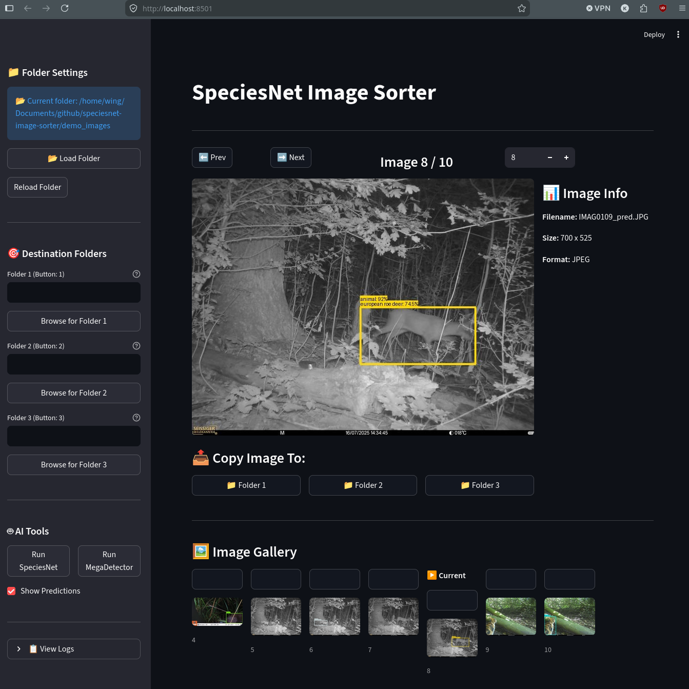

# SpeciesNetImageSorter (Streamlit)

[For using the old unsupported PYQT app, see the README in the folder ./pyqt_app]

Web app for browsing wildlife images/videos, sorting files into destination folders, and running SpeciesNet + MegaDetector from a Streamlit interface.



## Requirements

- Python 3.13.x (project is pinned to `==3.13.*`)
- Linux/macOS/Windows
- Enough RAM/CPU for model inference (GPU can help but is optional)

## Install

Using `uv` (recommended):

```bash
uv sync
```

Using `pip`:

```bash
python -m venv .venv
source .venv/bin/activate
pip install -e .
```

## Run (Streamlit only)

From the repository root:

```bash
uv run streamlit run app/streamlit_app.py
```

Or with an active virtual environment:

```bash
streamlit run app/streamlit_app.py
```

Streamlit will print a local URL (typically `http://localhost:8501`).

## Usage

### 1. Load media

1. Click **Load Folder** in the sidebar.
2. Select a folder containing images and/or videos.
3. The app loads supported files and shows them in the main viewer and thumbnail gallery.

On macOS, especially on M1/M2 systems, Streamlit may run the Tk folder picker off the main thread. If the native dialog does not open, use the **Image Folder Path** field in the sidebar and then click **Load Folder**. The app will prefer the typed path before trying the dialog.

Supported image formats:

- `.png`, `.jpg`, `.jpeg`, `.bmp`, `.gif`

Supported video formats:

- `.mp4`, `.avi`, `.mov`, `.mkv`, `.flv`, `.wmv`, `.webm`

### 2. Sort media into folders

1. Configure up to 3 destination folders in the sidebar.
2. Use **Prev/Next**, **Jump to**, or thumbnails to navigate.
3. Click **Folder 1 / Folder 2 / Folder 3** under the current image to copy it.

### 3. Filter to predicted images (checkbox)

Use the sidebar checkbox **Show only images with predictions (conf > 0.1)** to focus on model-positive results.

- The filter keeps only files that have at least one detection with confidence `> 0.1` in `predictions.json`.
- Files with low-confidence-only detections are hidden by this filter.
- MegaDetector visualization files (for example `*_pred.jpg` and `*_pred_1.jpg`) are also shown when their source image matches a prediction above the threshold.
- The app supports both prediction JSON layouts:
	- `images[].file`
	- `predictions[].filepath`

### 4. Run SpeciesNet

1. Load a folder with wildlife media.
2. Click **Run SpeciesNet**.
3. The app writes `predictions.json` in the selected folder.
4. Detection details appear in the right info panel.

### 5. CUDA checkbox (NVIDIA GPU)

Use the sidebar checkbox **Use CUDA for SpeciesNet (if available)** to control GPU usage for SpeciesNet.

- This checkbox is intended for NVIDIA GPUs with CUDA support.
- When enabled and CUDA is available, SpeciesNet is allowed to run on GPU.
- When enabled but CUDA is not available, the app falls back to CPU and logs a warning.
- When disabled, the app forces CPU execution.

### 6. Run MegaDetector visualization

1. Ensure `predictions.json` exists (run SpeciesNet first).
2. Click **Run MegaDetector**.
3. Visualization outputs are generated in the same folder.
4. Click **Reload Folder** to refresh the gallery if needed.

## Video notes

- Video support is experimental.
- The app extracts frames from videos and runs inference on those frames.
- Large/long videos can create many frames and slow down processing.

## Optional offline model setup

If you want to pre-download model weights for local/offline use:

```bash
python pyqt_app/weights/download_weights.py
```

## Troubleshooting

- **No folder dialog opens on Linux:** install Tk support for your Python distribution (`tkinter` is required for the folder picker).
- **`NSWindow should only be instantiated on the main thread` on macOS:** avoid the native folder picker and paste the folder into **Image Folder Path** instead.
- **No files loaded:** verify media extensions are supported and files are inside the selected folder.
- **MegaDetector fails:** check that `predictions.json` exists in the loaded folder.

## Issues

If you hit a bug, open an issue with:

- OS and Python version
- Exact command used
- Relevant log/error output
